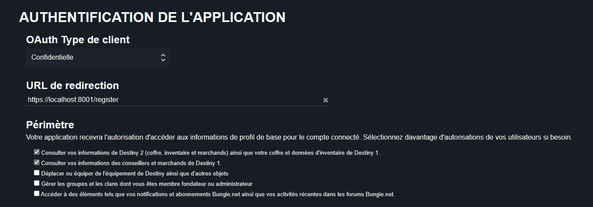
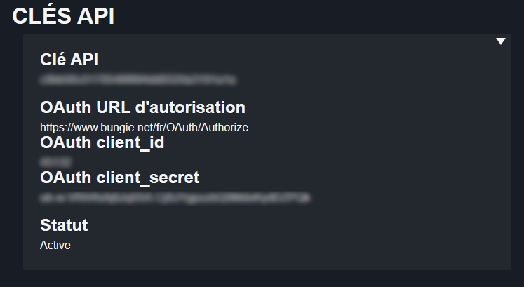

# Presentaion
C'est un petit projet perso qui interagit avec L'API de Bungie Destiny2.

! Le projet est toujours en construction !

Pour commencer crée votre application sûre : https://www.bungie.net/fr/Application

# Parametre application Bungie
Statut de l'application : Privé

OAuth Type de client: Confidentielle
URL de redirection: https://localhost:8001/register

Entête Origin : *

Vous obtiendrai ceci:

Crée un fichier Configu.json dans Src/Configu.json avec les informations suivantes:

{
    "API_KEY" : "Votre API_KEY",
    
    "CLIENT_ID" : "Votre CLIENT_ID",
    
    "CLIENT_SECRET" : "Votre CLIENT_SECRET",
    
    "OAUTHURL" : "https://www.bungie.net/fr/OAuth/Authorize "
    
}

Créé aussi avec la commande: mkcert localhost deux fichier localhost et localhost-key.
